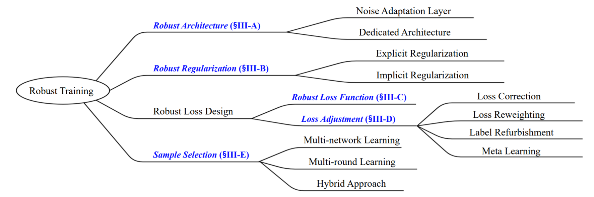

### Intelligent Data Annotation and Fault Diagnosis Under Noisy Labels (IDAFD-UNL)

>**Motivation:** Intelligent data annotation and fault diagnosis (IDAFD) is of great interest in both academia and industry. In the past decades, IDAFD has evolved from expertise-based to data-driven fault diagnosis (see Fig .1) and achieved great success. However, this success is predicated on the correctly annotated datasets. Labels in large industrial datasets can be noisy and thus degrade the performance of fault diagnosis models. In recent years, deep learning-based label-denoising (DLLD) has gained attention in the field of fault diagnosis. Nevertheless, the related research is still limited in the prognostics and health management (PHM) community. To promote the development of IDAFD-UNL, we created this repository. 


|  | 
|:--:| 
| *Fig 1. The development of intelligent fault diagnosis.* |

>**Background:** In practice, data-driven fault diagnosis require diverse data with reliable labels for training and evaluation. However, the acquirement of essential data is difficult due to limited working conditions and collection costs. Moreover, even if the essential data can be collected, perfect data annotation remains a challenge because of insufficient labeling expertise and  complicated labeling workload. Current data annotation has evolved from expert-based, to crowd-source-based and model-automation-based labeling. However, the available data labeling strategies can hardly guarantee perfect annotation without corrupted labels. Hence, the label noise problem, i.e., data with corrupted labels, is introduced and brings new challenges to data-driven fault diagnosis.


|  | 
|:--:| 
| *Fig 2. Label noise from annotators in fault diagnosis.* |

>**Resources:** We have collected excellent resources in this repository, such as datasets, papers, and available codes. Any issue or pull request is welcomed. 

:star:: If this repository facilitates your current or future research and make positive contribution to your study. Please cite the reference as follows.

```
@article{liu2022knowledge,
  title={An Active Label-denoising Algorithm Based on Broad Learning for Annotation of Machine Health Status},
  author={Liu, Guokai and Shen, Weiming and Gao, Liang and Kusiak, Andrew},
  journal={Science China Technological Sciences},
  notes={This manuscirpt is currently under review}, 
  year={2022}
}
```

---
### Label noise simulation


|  | 
|:--:| 
| *Fig 3. Simulated symmetric and asymmetric label noise.* |


- Function
```python
def flip_label(y, pattern, ratio, dt='CWRU', one_hot=False, random_seed=42):
    import numpy as np
    # Source: https://github.com/chenpf1025/noisy_label_understanding_utilizing
    # y: true label, one hot
    # pattern: 'Symm' or 'Asym'
    # p: float, noisy ratio

    y=y.copy()
    if dt=='CWRU':
        # Source: https://github.com/udibr/noisy_labels
        flip = {0:7, 1:9, 2:0, 3:4, 4:2, 5:1, 6:3, 7:5, 8:6, 9:8}
    else:
        print('Please assign your fliping dictionary')
    
    # convert one hot label to int
    if one_hot:
        y = np.argmax(y,axis=1) #[np.where(r==1)[0][0] for r in y]
    n_class = max(y)+1
    
    # filp label
    np.random.seed(random_seed)
    for i in range(len(y)):
        if pattern=='Symm':
            p1 = ratio/(n_class-1)*np.ones(n_class)
            p1[y[i]] = 1-ratio
            y[i] = np.random.choice(n_class,p=p1)
        elif pattern=='Asym':
            # y[i] = np.random.choice([y[i],(y[i]+1)%n_class],p=[1-ratio,ratio])            
            y[i] = np.random.choice([y[i],flip[y[i]]],p=[1-ratio,ratio])            
            
    # convert back to one hot
    if one_hot:
        y = np.eye(n_class)[y]
    return y
```

- Demo
```python
# Simulate label noise
Yn1 = flip_label(Ys, 'Symm', 0.35, dt=args.dataset)
Yn2 = flip_label(Ys, 'Asym', 0.35, dt=args.dataset)
```

---

### PHM Datasets

|  | 
|:--:| 
| *Fig 4. Open‐sourced datasets for fault diagnosis and prognosis.* |

```

@article{liu2022knowledge,
  title={Knowledge transfer in fault diagnosis of rotary machines},
  author={Liu, Guokai and Shen, Weiming and Gao, Liang and Kusiak, Andrew},
  journal={IET Collaborative Intelligent Manufacturing},
  volume={4},
  number={1},
  pages={17--34},
  year={2022}
}
```

---

### IFDUNL Papers

1. Nie X, Xie G (2020) A Novel Normalized Recurrent Neural Network for Fault Diagnosis with Noisy Labels. J Intell Manuf. https://doi.org/10.1007/s10845-020-01608-8
2. Nie X, Xie G (2021) A Fault Diagnosis Framework Insensitive to Noisy Labels Based on Recurrent Neural Network. IEEE Sensors Journal 21:2676–2686. https://doi.org/10.1109/JSEN.2020.3023748
3. Zhang K, Tang B, Deng L, et al (2021) A Fault Diagnosis Method for Wind Turbines Gearbox Based on Adaptive Loss Weighted Meta-ResNet under Noisy Labels. Mechanical Systems and Signal Processing 161:107963. https://doi.org/10.1016/j.ymssp.2021.107963
4. Ainapure A, Li X, Singh J, et al (2020) Enhancing Intelligent Cross-Domain Fault Diagnosis Performance on Rotating Machines with Noisy Health Labels. Procedia Manufacturing 48:940–946. https://doi.org/10.1016/j.promfg.2020.05.133
5. Ainapure A, Siahpour S, Li X, et al (2022) Intelligent Robust Cross-Domain Fault Diagnostic Method for Rotating Machines Using Noisy Condition Labels. Mathematics 10:455. https://doi.org/10.3390/math10030455


---

### ML/DL Surveys

1. Frenay B, Verleysen M (2014) Classification in the Presence of Label Noise: A Survey. IEEE Transactions on Neural Networks and Learning Systems 25:845–869. https://doi.org/10.1109/TNNLS.2013.2292894
2. Han B, Yao Q, Liu T, et al (2020) A Survey of Label-noise Representation Learning: Past, Present and Future. https://doi.org/10.48550/arXiv.2011.04406

1. Cordeiro FR, Carneiro G (2020) A Survey on Deep Learning with Noisy Labels: How to train your model when you cannot trust on the annotations? In: 2020 33rd SIBGRAPI Conference on Graphics, Patterns and Images (SIBGRAPI). pp 9–16. https://doi.org/10.1109/SIBGRAPI51738.2020.00010
2. Algan G, Ulusoy I (2021) Image Classification with Deep Learning in the Presence of Noisy Labels: A Survey. Knowledge-Based Systems 215:106771. https://doi.org/10.1016/j.knosys.2021.106771
3. Song H, Kim M, Park D, et al (2022) Learning From Noisy Labels With Deep Neural Networks: A Survey. IEEE Transactions on Neural Networks and Learning Systems 1–19. https://doi.org/10.1109/TNNLS.2022.3152527


---

### A Taxonomy

|  | 
|:--:| 
| *Fig 5. High-level research overview of robust deep learning for noisy labels.* |


:star:: This section was copied from https://github.com/songhwanjun/Awesome-Noisy-Labels. Please refer to it for more details.


```
@article{song2022learning,
  title={Learning from noisy labels with deep neural networks: A survey},
  author={Song, Hwanjun and Kim, Minseok and Park, Dongmin and Shin, Yooju and Lee, Jae-Gil},
  journal={IEEE Transactions on Neural Networks and Learning Systems},
  year={2022},
  publisher={IEEE}
}
```


```
Robust Learning for Noisy Labels
|--- A. Robust Architecture
     |--- A.1. Noise Adaptation Layer: adding a noise adaptation layer at the top of an underlying DNN to learn label transition process
     |--- A.2. Dedicated Architecture: developing a dedicated architecture to reliably support more diverse types of label noises.
|--- B. Robust Regularization
     |--- B.1. Explicit Regularization: an explicit form that modifies the expected tarining loss, e.g., weight decay and dropout.
     |--- B.2. Implicit Regularization: an implicit form that gives the effect of stochasticity, e.g., data augmentation and mini-batch SGD.
|--- C. Robust Loss Function: designing a new loss function robust to label noise.
|--- D. Loss Adjsutment
     |--- D.1. Loss Correction: multiplying the estimated transition matrix to the prediction for all the observable labels.
     |--- D.2. Loss Reweighting: multiplying the estimated example confidence (weight) to the example loss.
     |--- D.3. Label Refurbishment: replacing the original label with other reliable one.
     |--- D.4. Meta Learning: finding an optimal adjustment rule for loss reweighing or label refurbishment.
|--- E. Sample Selection
     |--- E.1. Multi-network Learning: collaborative learning or co-training to identify clean examples from noisy data.
     |--- E.2. Multi-round Learning: refining the selected clean set through training multiple rounds.
     |--- E.3. Hybrid Leanring: combining a specific sample selection strategy with a specific semi-supervised learning model or other orthogonal directions.
```


<a name="A"></a>

#### A. [Robust Architecture]

##### A.1. Noise Adaptation Layer

| Year   | Venue   | Title      |  Implementation  | 
| :----: | :-----: | :--------: |:----------------:|
| 2015   | ICCV    | [Webly supervised learning of convolutional networks](https://openaccess.thecvf.com/content_iccv_2015/papers/Chen_Webly_Supervised_Learning_ICCV_2015_paper.pdf) | [Official (Caffe)](https://github.com/endernewton/webly-supervised) |
| 2015   | ICLRW   | [Training convolutional networks with noisy labels](https://arxiv.org/pdf/1406.2080.pdf) | [Unofficial (Keras)](https://github.com/delchiaro/training-cnn-noisy-labels-keras) |
| 2016   | ICDM    | [Learning deep networks from noisy labels with dropout regularization](https://ieeexplore.ieee.org/abstract/document/7837934?casa_token=_c8jgFFbUQcAAAAA:2Twk6ktUkTm20xdAcD_g8sZcy7BJa8dvNND3_T21tjL-Dg0w4L797W3aVnqRQpn9IcSRLk-6_JQ5XZU) | [Official (MATLAB)](https://github.com/ijindal/Noisy_Dropout_regularization) |
| 2016   | ICASSP  | [Training deep neural-networks based on unreliable labels](https://ieeexplore.ieee.org/document/7472164) | [Unofficial (Chainer)](https://github.com/Ryo-Ito/Noisy-Labels-Neural-Network) |
| 2017   | ICLR    | [Training deep neural-networks using a noise adaptation layer](https://openreview.net/forum?id=H12GRgcxg) | [Official (Keras)](https://github.com/udibr/noisy_labels) |

##### A.2. Dedicated Architecture

| Year   | Venue   | Title      |  Implementation  | 
| :----: | :-----: | :--------: |:----------------:|
| 2015   | CVPR    | [Learning from massive noisy labeled data for image classification](https://openaccess.thecvf.com/content_cvpr_2015/papers/Xiao_Learning_From_Massive_2015_CVPR_paper.pdf)     |  [Official (Caffe)](https://github.com/Cysu/noisy_label)    |
| 2018   | NeurIPS    | [Masking: A new perspective of noisy supervision](https://proceedings.neurips.cc/paper/2018/file/aee92f16efd522b9326c25cc3237ac15-Paper.pdf)     | [Official (TensorFlow)](https://github.com/bhanML/Masking)     |
| 2018   | TIP   | [Deep learning from noisy image labels with quality embedding](https://ieeexplore.ieee.org/stamp/stamp.jsp?arnumber=8506425)     |  N/A    |
| 2019   | ICML    | [Robust inference via generative classifiers for handling noisy labels](http://proceedings.mlr.press/v97/lee19f.html)    |  [Official (PyTorch)](https://github.com/pokaxpoka/RoGNoisyLabel)    |

<a name="B"></a>

#### B. [Robust Regularization]

##### B.1. Explicit Regularization

| Year   | Venue   | Title      |  Implementation  | 
| :----: | :-----: | :--------: |:----------------:|
| 2018   | ECCV    | [Deep bilevel learning](https://openaccess.thecvf.com/content_ECCV_2018/papers/Simon_Jenni_Deep_Bilevel_Learning_ECCV_2018_paper.pdf)    | [Official (TensorFlow)](https://github.com/sjenni/DeepBilevel)     |
| 2019   | CVPR    | [Learning from noisy labels by regularized estimation of annotator confusion](https://openaccess.thecvf.com/content_CVPR_2019/papers/Tanno_Learning_From_Noisy_Labels_by_Regularized_Estimation_of_Annotator_Confusion_CVPR_2019_paper.pdf)     |  [Official (TensorFlow)](https://rt416.github.io/pdf/trace_codes.pdf)    |
| 2019   | ICML    | [Using pre-training can improve model robustness and uncertainty](http://proceedings.mlr.press/v97/hendrycks19a.html)     |  [Official (PyTorch)](github.com/hendrycks/pre-training)    |
| 2020   | ICLR    | [Can gradient clipping mitigate label noise?](https://openreview.net/forum?id=rklB76EKPr)     |   [Unofficial (PyTorch)](https://github.com/dmizr/phuber)   |
| 2020   | ICLR    | [Wasserstein adversarial regularization (WAR) on label noise](https://openreview.net/forum?id=SJldu6EtDS)   |  N/A    |
| 2021   | ICLR    | [Robust early-learning: Hindering the memorization of noisy labels](https://openreview.net/forum?id=Eql5b1_hTE4)     |  [Official (PyTorch)](https://github.com/xiaoboxia/CDR)    |
| 2021   | ICLR    | [When Optimizing f-Divergence is Robust with Label Noise](https://openreview.net/forum?id=WesiCoRVQ15) | [Official (PyTorch)](weijiaheng/Robust-f-divergence-measures)   |
| 2021   | ICCV    | [Learning with Noisy Labels via Sparse Regularization](https://openaccess.thecvf.com/content/ICCV2021/html/Zhou_Learning_With_Noisy_Labels_via_Sparse_Regularization_ICCV_2021_paper.html) | [Official (PyTorch)](https://github.com/hitcszx/lnl_sr) |
| 2021   | NeurIPS | [Open-set Label Noise Can Improve Robustness Against Inherent Label Noise](https://papers.nips.cc/paper/2021/hash/428fca9bc1921c25c5121f9da7815cde-Abstract.html)  | [Official (PyTorch)](https://github.com/hongxin001/ODNL) |

##### B.2. Implicit Regularization

| Year   | Venue   | Title      |  Implementation  | 
| :----: | :-----: | :--------: |:----------------:|
| 2015   | ICLR    | [Explaining and harnessing adversarial examples](https://arxiv.org/pdf/1412.6572.pdf)     | [Unofficial (PyTorch)](https://https://github.com/sarathknv/adversarial-examples-pytorch)    |
| 2017   | ICLRW   | [Regularizing neural networks by penalizing confident output distributions](https://openreview.net/forum?id=HyhbYrGYe)    |  [Unofficial (PyTorch)](https://github.com/CoinCheung/pytorch-loss)    |
| 2018   | ICLR    | [Mixup: Beyond empirical risk minimization](https://openreview.net/forum?id=r1Ddp1-Rb)     |  [Official (PyTorch)](https://github.com/facebookresearch/mixup-cifar10)   |
| 2021   | CVPR    | [Augmentation Strategies for Learning with Noisy Labels](https://openaccess.thecvf.com/content/CVPR2021/html/Nishi_Augmentation_Strategies_for_Learning_With_Noisy_Labels_CVPR_2021_paper.html) | [Official (PyTorch)](https://github.com/KentoNishi/Augmentation-for-LNL) |
| 2021   | CVPR    | [AutoDO: Robust AutoAugment for Biased Data With Label Noise via Scalable Probabilistic Implicit Differentiation](https://openaccess.thecvf.com/content/CVPR2021/html/Gudovskiy_AutoDO_Robust_AutoAugment_for_Biased_Data_With_Label_Noise_via_CVPR_2021_paper.html)  | [Official (PyTorch)](https://github.com/gudovskiy/autodo)  |


<a name="C"></a>

#### C. [Robust Loss Function]

| Year   | Venue   | Title      |  Implementation  | 
| :----: | :-----: | :--------: |:----------------:|
| 2017   | AAAI    | [Robust loss functions under label noise for deep neural networks](https://arxiv.org/pdf/1712.09482.pdf)    |   N/A   |
| 2017   | ICCV    | [Symmetric cross entropy for robust learning with noisy labels](https://openaccess.thecvf.com/content_ICCV_2019/papers/Wang_Symmetric_Cross_Entropy_for_Robust_Learning_With_Noisy_Labels_ICCV_2019_paper.pdf)     |  [Official (Keras)](https://github.com/YisenWang/symmetric\_cross\_entropy\_for\_noisy_label)    |
| 2018   | NeurIPS | [Generalized cross entropy loss for training deep neural networks with noisy labels](https://papers.nips.cc/paper/2018/hash/f2925f97bc13ad2852a7a551802feea0-Abstract.html)    |  [Unofficial (PyTorch)](https://github.com/AlanChou/Truncated-Loss)    |
| 2020   | ICLR    | [Curriculum loss: Robust learning and generalization against label corruption](https://openreview.net/forum?id=rkgt0REKwS)     |  N/A   |
| 2020   | ICML    | [Normalized loss functions for deep learning with noisy labels](http://proceedings.mlr.press/v119/ma20c.html)     |  [Official (PyTorch)](https://github.com/HanxunH/Active-Passive-Losses)    |
| 2020   | ICML    | [Peer loss functions: Learning from noisy labels without knowing noise rates](http://proceedings.mlr.press/v119/liu20e/liu20e.pdf) |  [Official (PyTorch)](https://github.com/gohsyi/PeerLoss)    |
| 2021   | CVPR    | [Learning Cross-Modal Retrieval with Noisy Labels](https://openaccess.thecvf.com/content/CVPR2021/html/Hu_Learning_Cross-Modal_Retrieval_With_Noisy_Labels_CVPR_2021_paper.html)  | [Official (Pytorch)](https://github.com/XLearning-SCU/2021-CVPR-MRL) |
| 2021   | CVPR    | [A Second-Order Approach to Learning With Instance-Dependent Label Noise](https://openaccess.thecvf.com/content/CVPR2021/html/Zhu_A_Second-Order_Approach_to_Learning_With_Instance-Dependent_Label_Noise_CVPR_2021_paper.html) | [Official (PyTorch)](https://github.com/UCSC-REAL/CAL) |
| 2022   | ICLR    | [An Information Fusion Approach to Learning with Instance-Dependent Label Noise](https://openreview.net/forum?id=ecH2FKaARUp) | N/A |

<a name="D"></a>

#### D. [Loss Adjustment]
##### D.1. Loss Correction

| Year   | Venue   | Title      |  Implementation  | 
| :----: | :-----: | :--------: |:----------------:|
| 2017   | CVPR    | [Making deep neural networks robust to label noise: A loss correction approach](https://openaccess.thecvf.com/content_cvpr_2017/papers/Patrini_Making_Deep_Neural_CVPR_2017_paper.pdf)     |   [Official (Keras)](https://github.com/giorgiop/loss-correction)   |
| 2018   | NeurIPS    | [Using trusted data to train deep networks on labels corrupted by severe noise](https://papers.nips.cc/paper/2018/file/ad554d8c3b06d6b97ee76a2448bd7913-Paper.pdf)    |  [Official (PyTorch)](https://github.com/mmazeika/glc)    |
| 2019   | NeurIPS    | [Are anchor points really indispensable in label-noise learning?](https://proceedings.neurips.cc/paper/2019/file/9308b0d6e5898366a4a986bc33f3d3e7-Paper.pdf)    |  [Official (PyTorch)](https://github.com/xiaoboxia/T-Revision)   |
| 2020   | NeurIPS    | [Dual T: Reducing estimation error for transition matrix in label-noise learning](https://proceedings.neurips.cc/paper/2020/file/512c5cad6c37edb98ae91c8a76c3a291-Paper.pdf)     |  N/A    |
| 2021   | AAAI  | [Tackling Instance-Dependent Label Noise via a Universal Probabilistic Model](https://arxiv.org/abs/2101.05467) | [Official (PyTorch)](https://github.com/QizhouWang/instance-dependent-label-noise) |

##### D.2. Loss Reweighting

| Year   | Venue   | Title      |  Implementation  | 
| :----: | :-----: | :--------: |:----------------:|
| 2017   | TNNLS   | [Multiclass learning with partially corrupted labels](https://ieeexplore.ieee.org/stamp/stamp.jsp?arnumber=7929355)     |  [Unofficial (PyTorch)](https://github.com/xiaoboxia/Classification-with-noisy-labels-by-importance-reweighting)   |
| 2017   | NeurIPS | [Active Bias: Training more accurate neural networks by emphasizing high variance samples](https://papers.nips.cc/paper/2017/file/2f37d10131f2a483a8dd005b3d14b0d9-Paper.pdf)     |  [Unofficial (TensorFlow)](https://github.com/songhwanjun/ActiveBias)    |

##### D.3. Label Refurbishment

| Year   | Venue   | Title      |  Implementation  | 
| :----: | :-----: | :--------: |:----------------:|
| 2015   | ICLR    | [Training deep neural networks on noisy labels with bootstrapping](https://arxiv.org/pdf/1412.6596.pdf)    |  [Unofficial (Keras)](https://github.com/dr-darryl-wright/Noisy-Labels-with-Bootstrapping)    |
| 2018   | ICML    | [Dimensionality-driven learning with noisy labels](http://proceedings.mlr.press/v80/ma18d/ma18d.pdf)    |  [Official (Keras)](https://github.com/xingjunm/dimensionality-driven-learning)    |
| 2019   | ICML    | [Unsupervised label noise modeling and loss correction](http://proceedings.mlr.press/v97/arazo19a/arazo19a.pdf)    |   [Official (PyTorch)](https://github.com/PaulAlbert31/LabelNoiseCorrection)   |
| 2020   | NeurIPS | [Self-adaptive training: beyond empirical risk minimization](https://proceedings.neurips.cc/paper/2020/file/e0ab531ec312161511493b002f9be2ee-Paper.pdf)     |  [Official (PyTorch)](https://github.com/LayneH/self-adaptive-training)    |
| 2020   | ICML    | [Error-bounded correction of noisy labels](http://proceedings.mlr.press/v119/zheng20c/zheng20c.pdf)    |  [Official (PyTorch)](https://github.com/pingqingsheng/LRT)    |
| 2021   | AAAI    | [Beyond class-conditional assumption: A primary attempt to combat instancedependent label noise](https://arxiv.org/pdf/2012.05458.pdf)     | [Official (PyTorch)](https://github.com/chenpf1025/IDN)     |

##### D.4. Meta Learning

| Year   | Venue   | Title      |  Implementation  | 
| :----: | :-----: | :--------: |:----------------:|
| 2017   | NeurIPSW    | [Learning to learn from weak supervision by full supervision](https://arxiv.org/pdf/1711.11383.pdf)     |  [Unofficial (TensorFlow)](https://github.com/krayush07/learn-by-weak-supervision)   |
| 2017   | ICCV    | [Learning from noisy labels with distillation](https://openaccess.thecvf.com/content_ICCV_2017/papers/Li_Learning_From_Noisy_ICCV_2017_paper.pdf)    |  N/A   |
| 2018   | ICML    | [Learning to reweight examples for robust deep learning](http://proceedings.mlr.press/v80/ren18a/ren18a.pdf)   | [Official (TensorFlow)](https://github.com/uber-research/learning-to-reweight-examples)     |
| 2019   | NeurIPS    | [Meta-Weight-Net: Learning an explicit mapping for sample weighting](https://arxiv.org/pdf/1902.07379.pdf)    | [Official (PyTorch)](https://github.com/xjtushujun/meta-weight-net)     |
| 2020   | CVPR    | [Distilling effective supervision from severe label noise](https://openaccess.thecvf.com/content_CVPR_2020/papers/Zhang_Distilling_Effective_Supervision_From_Severe_Label_Noise_CVPR_2020_paper.pdf)     |  [Official (TensorFlow)](https://github.com/google-research/google-research/tree/master/ieg)    |
| 2021   | AAAI    | [Meta label correction for noisy label learning](https://www.aaai.org/AAAI21Papers/AAAI-10188.ZhengG.pdf)     |  [Official (PyTorch)](https://aka.ms/MLC)    |
| 2021   | ICCV    | [Adaptive Label Noise Cleaning with Meta-Supervision for Deep Face Recognition](https://openaccess.thecvf.com/content/ICCV2021/html/Zhang_Adaptive_Label_Noise_Cleaning_With_Meta-Supervision_for_Deep_Face_Recognition_ICCV_2021_paper.html) | N/A  |

<a name="E"></a>

#### E. [Sample Selection]

##### E.1. Multi-network Learning

| Year   | Venue   | Title      |  Implementation  | 
| :----: | :-----: | :--------: |:----------------:|
| 2017   | NeurIPS    | [Decoupling when to update from how to update](https://dl.acm.org/doi/pdf/10.5555/3294771.3294863)    |  [Official (TensorFlow)](https://github.com/emalach/UpdateByDisagreemen)    |
| 2018   | ICML    |  [MentorNet: Learning data-driven curriculum for very deep neural networks on corrupted labels](http://proceedings.mlr.press/v80/jiang18c/jiang18c.pdf)    |  [Official (TensorFlow)](https://github.com/google/mentornet)    |
| 2018   | NeurIPS    |  [Co-teaching: Robust training of deep neural networks with extremely noisy labels](https://arxiv.org/pdf/1804.06872.pdf)    |  [Official (PyTorch)](https://github.com/bhanML/Co-teaching)    |
| 2019   | ICML    | [How does disagreement help generalization against label corruption?](http://proceedings.mlr.press/v97/yu19b/yu19b.pdf)    |  [Official (PyTorch)](https://github.com/bhanML/coteaching_plus)   |
| 2021   | CVPR    | [Jo-SRC: A Contrastive Approach for Combating Noisy Labels](https://openaccess.thecvf.com/content/CVPR2021/html/Yao_Jo-SRC_A_Contrastive_Approach_for_Combating_Noisy_Labels_CVPR_2021_paper.html) | [Official (PyTorch)](https://github.com/NUST-Machine-Intelligence-Laboratory/Jo-SRC) |


##### E.2. Single- or Multi-round Learning

| Year   | Venue   | Title      |  Implementation  | 
| :----: | :-----: | :--------: |:----------------:|
| 2018   | CVPR    | [Iterative learning with open-set noisy labels](https://openaccess.thecvf.com/content_cvpr_2018/papers/Wang_Iterative_Learning_With_CVPR_2018_paper.pdf)     |  [Official (Keras)](https://github.com/YisenWang/Iterative_learning)    |
| 2019   | ICML    | [Learning with bad training data via iterative trimmed loss minimization](http://proceedings.mlr.press/v97/shen19e/shen19e.pdf)     | [Official (GluonCV)](https://github.com/yanyao-shen/ITLM-simplecode)     |
| 2019   | ICML    | [Understanding and utilizing deep neural networks trained with noisy labels](http://proceedings.mlr.press/v97/chen19g/chen19g.pdf)     |  [Official (Keras)](https://github.com/chenpf1025/noisy_label_understanding_utilizing)    |
| 2019   | ICCV    | [O2U-Net: A simple noisy label detection approach for deep neural networks](https://ieeexplore.ieee.org/stamp/stamp.jsp?tp=&arnumber=9008796)     |  [Unofficial (PyTorch)](https://github.com/hjimce/O2U-Net)   |
| 2020   | ICMLW    | [How does early stopping can help generalization against label noise?](https://arxiv.org/pdf/1911.08059.pdf)     |  [Official (Tensorflow)](https://www.dropbox.com/sh/49py7tggwprpdup/AADFFsAGfn3EbtueYM0dI9Fea?dl=0)     |
| 2020   | NeurIPS  | [A topological filter for learning with label noise](https://proceedings.neurips.cc/paper/2020/file/f4e3ce3e7b581ff32e40968298ba013d-Paper.pdf)     |  [Official (PyTorch)](https://github.com/pxiangwu/TopoFilter)    |
| 2021   | ICLR    | [Learning with Instance-Dependent Label Noise: A Sample Sieve Approach](https://openreview.net/forum?id=2VXyy9mIyU3) | [Official (PyTorch)](https://github.com/UCSC-REAL/cores)  |
| 2021   | NeurIPS | [FINE Samples for Learning with Noisy Labels](https://papers.nips.cc/paper/2021/hash/ca91c5464e73d3066825362c3093a45f-Abstract.html) | [Official (PyTorch)](https://github.com/Kthyeon/FINE_official) |
| 2022   | ICLR    | [Sample Selection with Uncertainty of Losses for Learning with Noisy Labels](https://openreview.net/forum?id=xENf4QUL4LW) | N/A |


##### E.3. Hybrid Learning

| Year   | Venue   | Title      |  Implementation  | 
| :----: | :-----: | :--------: |:----------------:|
| 2019   | ICML    | [SELFIE: Refurbishing unclean samples for robust deep learning](http://proceedings.mlr.press/v97/song19b/song19b.pdf)    |   [Official (TensorFlow)](https://github.com/kaist-dmlab/SELFIE)   |
| 2020   | ICLR    | [SELF: Learning to filter noisy labels with self-ensembling](https://openreview.net/pdf?id=HkgsPhNYPS)     |   N/A   |
| 2020   | ICLR    | [DivideMix: Learning with noisy labels as semi-supervised learning](https://openreview.net/pdf?id=HJgExaVtwr)     |  [Official (PyTorch)](https://github.com/LiJunnan1992/DivideMix)    |
| 2021   | ICLR    | [Robust curriculum learning: from clean label detection to noisy label self-correction](https://openreview.net/pdf?id=lmTWnm3coJJ)     |  N/A    |
| 2021   | NeurIPS | [Understanding and Improving Early Stopping for Learning with Noisy Labels](https://papers.nips.cc/paper/2021/hash/cc7e2b878868cbae992d1fb743995d8f-Abstract.html) | [Official (PyTorch)](https://github.com/tmllab/PES) |


### Other Awesome Links
- https://github.com/songhwanjun/Awesome-Noisy-Labels
- https://github.com/GuokaiLiu/Noisy-Labels-Problem-Collection
- https://github.com/subeeshvasu/Awesome-Learning-with-Label-Noise
- https://github.com/gorkemalgan/deep_learning_with_noisy_labels_literature


